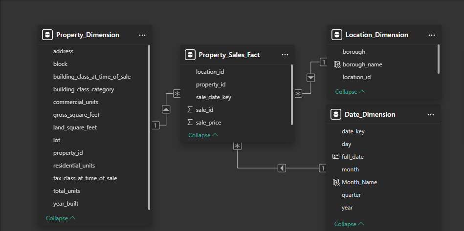

# NYC Property Sales Data Pipeline

## Project Overview
This project implements a comprehensive ETL (Extract, Transform, Load) pipeline for New York City property sales data spanning from 2010 to 2023 across four boroughs: Manhattan, Brooklyn, Queens, and the Bronx. 

The pipeline extracts raw property sales data from the NYC Department of Finance, processes and standardizes the data, loads it into a SQL Server database, and transforms it into a dimensional model for analytics.

## Data Source

- **Source:** NYC Department of Finance
- **Time Period:** 2010-2023
- **Boroughs:** Manhattan, Brooklyn, Queens, Bronx
- **File Format:** Excel (.xls/.xlsx)
- **Update Frequency:** Annual
- **Record Count:** ~996,853 property sales transactions

## Pipeline Architecture

The data pipeline follows a modular architecture with distinct stages:

### 1. Data Extraction

Raw property sales data is downloaded from the NYC Department of Finance website. The extraction process:
- Iterates through years (2010-2023) and boroughs
- Handles redirects from Office Online viewer URLs
- Downloads and saves Excel files to a local repository
- Manages connection issues and retries failed downloads

### 2. Data Staging

Raw data is loaded into a staging environment with minimal transformations:
- **Schema:** `staging.property_sales_raw`
- **Purpose:** Initial repository for raw data before cleansing
- **Process:**
  - Reads Excel files using appropriate engines based on file format
  - Handles varying header row positions across different years
  - Performs initial data type conversions
  - Logs processing metrics and errors

### 3. Data Cleansing

Data quality issues are addressed through an extensive cleansing process:
- **Schema:** `cleansed.property_sales_clean`
- **Key Transformations:**
  - Standardizing column names and formats
  - Removing duplicate records
  - Handling null values and anomalies
  - Converting data types
  - Standardizing address formats
  - Validating price and date ranges
  - Filtering invalid transactions (e.g., $0 sales)

### 4. Dimensional Modeling

The cleansed data is transformed into a star schema for analytics:

- **Fact Table:**
  - `dm.fact_property_sales` - Contains sale transactions with foreign keys to dimensions

- **Dimension Tables:**
  - `dm.dim_date` - Calendar dimensions with hierarchies for time-based analysis
  - `dm.dim_location` - Geographical dimensions (borough, zip code)
  - `dm.dim_property` - Property attributes (address, building class, size, units)
  
- **Relationships:**
  - Each sale in the fact table links to property characteristics, location information, and sale date
  - Surrogate keys maintain historical accuracy and enable slowly changing dimensions

## Data Processing Statistics

Based on pipeline execution logs:

- **Files Processed:** 52
- **Files with Errors:** 0
- **Total Records Loaded:** 996,853
- **Data Distribution by Borough:**
  - **Bronx:** 84,504 records (8.5%)
  - **Brooklyn:** 310,373 records (31.1%)
  - **Manhattan:** 255,180 records (25.6%)
  - **Queens:** 346,796 records (34.8%)

## Data Quality Measures

The pipeline implements several data quality measures:
- **Validation Rules:**
  - Sales prices must be greater than zero
  - Dates must fall within valid ranges (2010-2023)
  - Essential fields (borough, block, lot, address) cannot be null
  - Building classifications must match valid codes
- **Anomaly Detection:**
  - Identifies outlier prices based on neighborhood statistics
  - Flags inconsistent property attributes
  - Detects duplicate sale records
- **Data Profiling:**
  - Column-level null analysis
  - Distinct value frequency analysis
  - Pattern recognition for data standardization

## Analytics Dashboard

The dimensional model powers an analytics dashboard that provides insights into NYC real estate trends:

- **Market Overview:**
  - Sales volume and price trends over time
  - Seasonal patterns in transaction activity
  - Year-over-year comparison of market activity
  
- **Geographic Analysis:**
  - Heatmaps of transaction density by neighborhood
  - Price per square foot by borough and zip code
  - Transaction volume by location
  
- **Property Analysis:**
  - Sales distribution by building classification
  - Price trends by property size and unit count
  - Age of property vs. sale price correlation
  
- **Advanced Metrics:**
  - Market velocity (days on market)
  - Price appreciation by neighborhood
  - Commercial vs. residential property trends

## Known Limitations

1. Data for 2018 is missing for all boroughs
2. Inconsistent column presence across yearly files (particularly 'ease-ment')
3. Varying file formats require different processing approaches
4. Some sales may represent non-arm's length transactions
5. Limited contextual information for price anomalies

## Technical Architecture

- **Database:** Microsoft SQL Server
- **Data Processing:** Python with pandas, sqlalchemy
- **Orchestration:** Custom Python scripts with logging
- **Analytics:** Power BI 
- **Storage:** Local file system for raw data, SQL Server for processed data

## Future Enhancements

1. **Data Enrichment:**
   - Integrate property assessment data
   - Add geospatial coordinates for mapping
   - Include demographic and economic indicators

2. **Pipeline Improvements:**
   - Implement Airflow for orchestration
   - Add real-time data quality monitoring
   - Develop incremental loading processes

3. **Analytics Expansion:**
   - Predictive models for price trends
   - Anomaly detection for market shifts
   - Natural language generation for market reports

